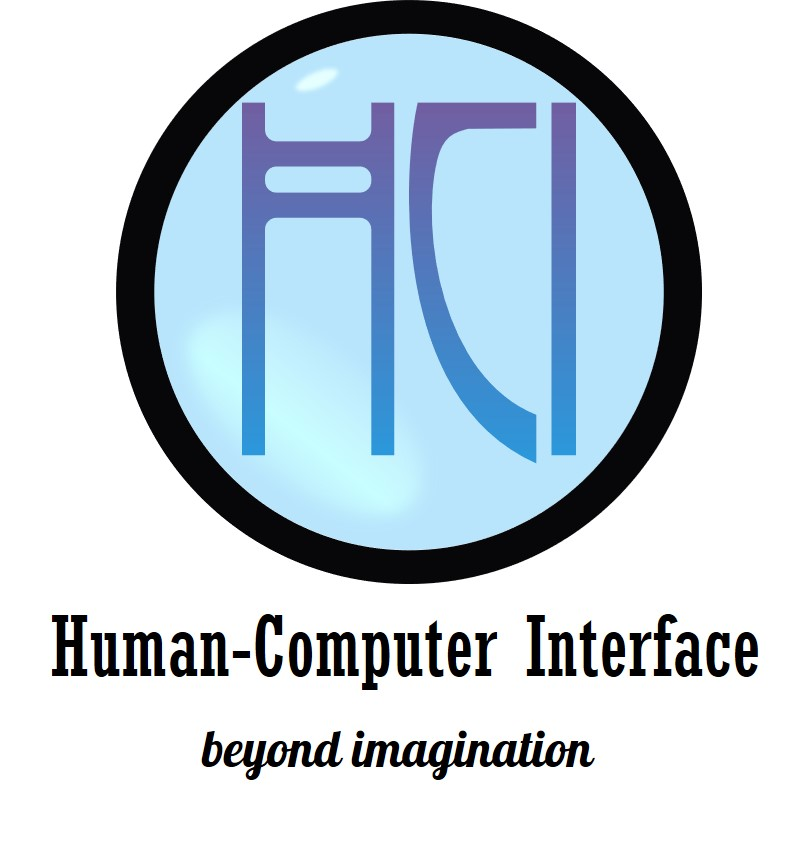

# Human-Computer Interface Lab

Human-Computer Interface Lab (HCI Lab) contributes on development of advanced intuitive interface technologies between human and computer/robot such as immersive virtual reality, augmented reality, teleoperation, and advanced human-robot interface for learning and assistive technology to improve human’s quality of life.

ห้องวิจัยด้านการเชื่อมต่อระหว่างมนุษย์และคอมพิวเตอร์ เน้นงานวิจัยและพัฒนาส่วนการติดต่อ (Interface) ทั้งทางด้านซอฟแวร์และฮาร์ดแวร์ เพื่อทำให้มนุษย์ผู้ใช้งานระบบคอมพิวเตอร์และหุ่นยนต์ให้ได้รับความสะดวกสบาย ง่ายและเป็นธรรมชาติมากที่สุด

## Official Website

http://fibo.kmutt.ac.th/fibo/research/fibo-laboratory/hci-lab/

## Social Network Service

https://www.facebook.com/HCI-Lab-FIBO-112352633545053/

## สารบัญ

- [สมาชิก](#สมาชิก)
- [ผลงาน](#ผลงาน)
- [โครงการต่าง ๆ](#โครงการต่าง-ๆ)
  - [2BKMUTT](#2BKMUTT)
  - [นักเรียน/นักศึกษาที่ฝึกงาน](#นักเรียนนักศึกษาที่ฝึกงาน)
  - [FIBO School Consotrium - Robot Project](#fibo-school-consotrium---robot-project)
- [คลังความรู้](https://github.com/fibohcilab/HCI-Learning)

## สมาชิก

- Coming Soon ...

## ผลงาน

- Coming Soon ...
- Mixed Reality
- [Tele-3D Printing](https://www.tele3dprinting.com)

## โครงการต่าง ๆ

### 2BKMUTT

- 2019
  - [Design and Development of Virtual Robot Exhibition using Virtual Reality Technology](https://github.com/fibohcilab/internship-2019-Design-and-Development-of-Virtual-Robot-Exhibition-using-Virtual-Reality-Technology)
  - [Robot Gripper for Detecting Object Using Flex Sensor](https://github.com/fibohcilab/2bkmutt-2019-Robot-Gripper-for-Detecting-Object-Using-Flex-Sensor)
  - [การพัฒนาระบบอัตโนมัติสำหรับการนำเสนอผลงานภายในห้องวิจัย Human-Computer Interface](https://github.com/fibohcilab/2bkmutt-2019--Human-Computer-Interface)
  - [การพัฒนาโลกเสมือนผสมความจริงควบคุมอุปกรณ์ผ่าน IoT](https://github.com/fibohcilab/2bkmutt-2019--IoT)

### นักเรียน/นักศึกษาที่ฝึกงาน

- 2020
  - FOBI v.3
  - Rock, Paper, Scissors

- 2019
  - [ARDobot](https://github.com/fibohcilab/internship-2019-ARDobot)

### FIBO School Consortium - Robot Project

- 2020
  - [Virtual Tour](Project/school%20consortium/2020/virtual%20tour/)

- 2019
  - VR Control Smart Device
  - Robotic arm
